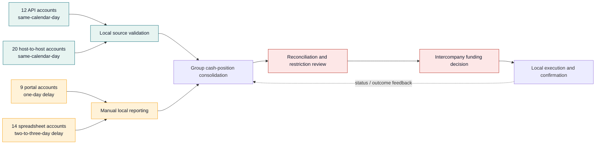
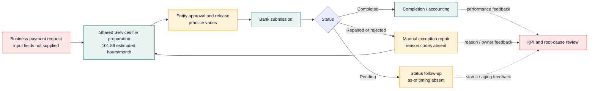

# Week 2 — Targeted Current-State Process Map and Draft RACI

**Prepared by:** Baker

**Status:** Draft for process-owner validation

**Classification:** Confidential — Project Northstar simulated client material

## Executive conclusion

ACG does not need an exhaustive process redesign before Week 3. It needs ownership and control clarity at three decision points: **when cash becomes visible, when it becomes certifiably movable, and when payment friction is classified and removed**. The maps below isolate those handoffs because they determine whether a targeted Wave 1 can deliver without an ERP replacement or control failure.

## Evidence boundary

These are targeted analytical maps, not observed end-to-end BPMN. They combine supplied process-activity estimates, client-brief observations, stakeholder statements, and reconciled data patterns. Handoffs and likely causes require confirmation with process owners. No process step below proves causation, removable labor, transferability, or control effectiveness.

## 1. Cash visibility and liquidity decision path

**Decision readout:** The supplied data places every delayed account in portal or spreadsheet sourcing. The practical Wave 1 question is therefore whether ACG can replace or control those handoffs for the highest-exposure accounts—not whether it should replace all three ERPs.

### Control and rework points

| Step | Current owner or source | Reconciled signal | Likely failure mechanism | Control that must remain | Decision impact | Confidence |
|---|---|---|---|---|---|---|
| Balance receipt | Bank/API/host-to-host/portal/spreadsheet | 23/55 accounts delayed; median $26.01m delayed positive estimate | Manual retrieval, file timing, or unclear source ownership | Completeness, authorized connectivity, source authentication | Determines visibility pilot scope | High for pattern; low for cause |
| Local cash reporting | Regional Finance | 66.88 estimated manual hours/month | Manual compilation and inconsistent definitions | Local review, restriction and settlement context | Determines which local autonomy must remain | Medium |
| Consolidated positioning | Group Treasury | 57.13 estimated manual hours/month | Reconciliation after delayed/manual inputs | Reconciled balance type, cutoff, audit trail | Determines daily position service level | Medium |
| Restriction/buffer review | Group Treasury + Regional Finance + Legal/Tax | $47.61m apparent net before buffer; no validated movable cash | Preliminary flags and no certified minimum operating cash | Entity authorization, legal/tax, service continuity | Gates every liquidity value claim | High for calculation; low for transferability |
| Funding decision | Group Treasury | Two account deficits on 181/181 days; entity deficits on 45 days | Reactive coordination or local timing | Approval limits, segregation, emergency process | Supports coordination, not booked savings | Medium |
| Execution confirmation | Regional Finance / Bank | No transfer or facility-use records supplied | Outcome is not linked back to the position | Confirmation, exception escalation, accounting entry | Prevents benefit validation | Low |

## 2. Payment preparation, release, and exception path

**Decision readout:** Manual-touch and cross-border-wire records deserve targeted root-cause testing, but the supplied file cannot tell whether manual work caused an exception, responded to it, or performed a required control.

### Control and rework points

| Step | Current owner | Reconciled signal | Likely failure mechanism | Control that must remain | Decision impact | Confidence |
|---|---|---|---|---|---|---|
| Request intake | Business unit / local finance | No invoice, beneficiary, urgency, or criticality fields supplied | Incomplete/late input is a stakeholder claim | Authorized request and required master data | Gates root-cause diagnosis | Low |
| File preparation | Shared Services | 101.89 estimated manual hours/month | Multiple formats and manual touch | Completeness, duplicate check, segregation | Candidate for standardization | Medium |
| Approval/release | Entity approvers | 380 late releases in supplied extract | Cutoff and approval variation are plausible | Approval authority, dual control, emergency release | Defines service and control design | Low |
| Bank submission | Shared Services / bank channel | Cross-border wires have 13.99% exceptions vs 4.41% domestic wires | Format/corridor complexity is plausible | Secure transmission, acknowledgement, resilience | Defines targeted cohort | Medium |
| Exception repair | Shared Services | 20,080 minutes in payment file; 102.60 hours/month in process file | Upstream input, format, policy, or user behavior unresolved | Repair approval, audit trail, resubmission control | Baselines differ by 84%; benefit not fundable | High for mismatch; low for cause |
| Performance review | Group Treasury / Shared Services | No controlled population or reason-code KPI | Ownership and feedback loop are not evidenced | KPI definition, data owner, corrective-action log | Required before scale | Low |

## Draft RACI for validation and Wave 1 readiness

**R = Responsible · A = Accountable · C = Consulted · I = Informed**

| Decision or control | CFO / SteerCo | Group Treasury | Regional Finance | Shared Services | IT / Data | Controls / Audit | Legal / Tax | BU Finance |
|---|---|---|---|---|---|---|---|---|
| Approve Week 2 evidence boundaries and Week 3 gates | A | R | C | C | C | C | C | I |
| Own global cash-visibility KPI and cutoff | I | A | R | I | R | C | I | I |
| Validate timestamps and source reconciliation for 55 accounts | I | A | R | I | R | C | I | I |
| Certify account-level mobility and operating buffers | I | A | R | I | C | C | R | C |
| Validate four closure candidates | I | A | R | I | C | C | R | C |
| Reconcile payment extract to controlled source population | I | A | C | R | R | C | I | I |
| Own exception reason taxonomy and corrective actions | I | C | C | A/R | R | C | I | R |
| Approve payment control and emergency-procedure requirements | I | A | C | R | C | C | I | C |
| Approve cybersecurity, access, resilience, and rollback gates | I | C | I | C | A/R | C | I | I |
| Validate observed process time and removability | I | A | R | R | C | C | I | C |
| Approve pilot cohort and avoid peak-season conflict | A | R | C | R | C | C | I | C |
| Validate benefits and release funding | A | R | C | C | C | C | C | I |

All owners are proposed until confirmed by the steering group. Internal Audit is consulted on control sufficiency; management retains accountability for operating the controls.

## Wave 1 feasibility gates

1. **Data gate:** Each pilot account has an authoritative source, named data owner, timestamp, cutoff, balance definition, and reconciliation rule.
2. **Mobility gate:** No cash enters the value case without legal/local certification, operating buffer, settlement constraints, transfer timing, and economics.
3. **Payment gate:** The extract reconciles to source totals; reason codes, criticality, and approval/release timestamps allow a causal test.
4. **Control gate:** Segregation, access, audit trail, emergency payment, service continuity, cybersecurity, resilience, and four-hour rollback are designed before go-live.
5. **Service gate:** The pilot avoids peak season and meets agreed cash-reporting and critical-payment service levels for four consecutive weeks before scale.
