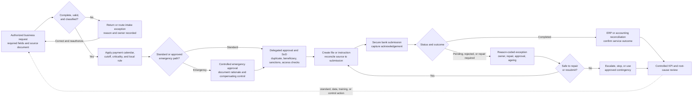

# Week 3 — Proposed Future-State Process Maps and RACI

**Prepared by:** Baker

**Prepared date:** 18 August 2026

**Working period:** 17–23 August 2026

**Status:** Analyst proposal; design only; not client-approved or authorized for execution

**Classification:** Confidential — Project Northstar simulated client material

## Purpose and boundary

These maps translate the proposed future-state operating model into explicit handoffs, decisions, controls, escalation points, and ownership. They are **target designs, not observed BPMN and not implementation instructions**. No step authorizes a production change, cash movement, account closure, payment release, labor removal, or benefit recognition.

They operationalize the provisional **federated-coordination** direction from `W3_strategic_options.md`: Group Treasury owns the common data, policy, control, and performance spine, while regional/local teams retain governed execution, exception, and emergency rights. The direction remains conditional; local stabilization is the fallback if ownership, staged integration, affordability, service, or control gates cannot close.

The design is grounded in five Week 2 facts: 23 of 55 accounts are delayed under the date proxy; the $38.13m result is a screening sensitivity and not movable cash; the 2,839-record priority-payment union contains 356 exceptions and 14,939 repair minutes within the supplied extract; the two repair baselines do not reconcile; and only four accounts meet the narrow closure-validation screen. All future-state thresholds, owners, and local rights remain proposed until client approval.

## Process 1 — Daily cash visibility, positioning, and funding decision

```mermaid
flowchart LR
    A[Expected account-day schedule<br/>source and owner] --> B[Receive bank or controlled local record<br/>capture timestamp and balance type]
    B --> C{Complete, authentic,<br/>and by approved cutoff?}
    C -->|No| D[Create owned data exception<br/>mark unavailable or unvalidated<br/>retain item in denominator]
    C -->|Yes| E[Source-to-position validation<br/>identifier, currency, value date]
    E --> F[Regional or local attestation<br/>restriction, buffer, event, service context]
    F --> G[Group Treasury consolidation<br/>reconcile and classify evidence layer]
    D -->|Exception layer only| G
    G --> H{Data valid and account-level mobility<br/>certified and current?}
    H -->|No| I[Keep value uncertified<br/>zero funded mobility contribution]
    H -->|Yes| J[Eligible for controlled<br/>funding-decision review]
    I --> K[Daily position and exception review]
    J --> K
    K --> L{Action within delegated<br/>authority and service constraints?}
    L -->|No| M[Escalate or take no action<br/>record rationale and owner]
    L -->|Yes| N[Dual-approved instruction<br/>local or approved shared execution]
    N --> O[Bank acknowledgement, accounting,<br/>settlement or status confirmation]
    M --> P[KPI, issue, and decision log]
    O --> P
    P -. corrective action and policy feedback .-> A
```

### Cash decision and control contract

| Step | Proposed accountable owner | Operator / contributor | Required evidence | Exception or stop rule | Linked controls |
|---|---|---|---|---|---|
| Define expected population and cutoff | Group Treasurer | IT/Data and Regional Finance | In-scope account calendar, approved cutoff, source, owner, balance type | No controlled denominator or owner → baseline/design only | CASH-01, GOV-01 |
| Receive and validate source record | Group Treasurer | IT/Data or controlled local operator | Receipt timestamp, authentication, account/value-date/currency identifiers, source trace | Missing or late record remains in denominator and becomes an owned exception | CASH-01, CASH-02, TECH-01 |
| Attest local context | Regional Finance | Local / BU Finance; Legal/Tax consulted | Restrictions, operating needs, settlement calendar, forecast event, purpose, service constraint | Unresolved context → no mobility certification or account action | CASH-03, GOV-02 |
| Consolidate and reconcile daily position | Group Treasurer | Treasury operations / IT-Data | Control total, break log, evidence layer, version and approval | Material unexplained break → pause decision and escalate | CASH-02, GOV-01 |
| Certify mobility and buffers | Group Treasurer | Regional Finance; Legal/Tax; Finance | Account-level certification, buffer basis, permitted action, effective/review date | Uncertified account contributes zero to funded mobility | CASH-03, GOV-03 |
| Approve funding action | Group Treasurer within delegated authority | Regional Finance consulted | Rationale, amount, entity, timing, authority, independent approval, contingency | Failed control, local-right, service, or authority test → no action | CASH-04, CASH-06 |
| Execute and confirm | Group Treasurer | Authorized local operator / approved bank channel | Instruction, bank acknowledgement, status/settlement evidence, accounting reference | Critical service/control issue or inability to recover → invoke approved contingency/rollback | CASH-05, CASH-06, TECH-03 |
| Review performance and corrective action | Group Treasurer | Data owner, Regional Finance, Finance, control owner | KPI version, exceptions, decisions, action owner/date, benefit evidence if applicable | No scale or value admission without reconciled evidence and owner approval | GOV-01, GOV-03 |

### Proposed service and escalation rules

| Trigger | Required response | Proposed decision owner | Current design status |
|---|---|---|---|
| Expected balance is late, missing, or fails source validation | Preserve the expected record in the denominator; open an exception; use the approved prior source only if its limitations are visible | Group Treasurer | Cutoff, materiality, and fallback source require approval |
| Position has a defined material unexplained reconciliation break | Pause the affected funding decision; preserve evidence; escalate to data and business owner | Group Treasurer | Materiality tolerance is TBD |
| Restriction, operating buffer, legal/tax position, or local service need is unresolved | Record the account as uncertified and take no mobility value or movement decision | Group Treasurer, with Regional Finance | Certification register is proposed |
| Payroll, tax, customer refund, critical supplier, or approved local obligation is at risk | Invoke the controlled emergency route within delegated authority; reconcile and review after the event | Relevant BU/Regional Finance owner | Emergency authority and limits require approval and testing |
| Access, segregation, cyber, audit-trail, or resilience control fails | Stop the affected change/action; notify the management control owner; remediate and retest | Management control owner / CIO | Test evidence not supplied |
| Later pilot cannot restore the approved prior process within four hours | Pause, preserve evidence, invoke rollback, and require reapproval before restart | Pilot accountable owner / CIO | Four-hour threshold is a proposed gate |

## Process 2 — Standard payment request, execution, and exception learning

### Payment decision and control contract

| Step | Proposed accountable owner | Operator / contributor | Required evidence | Exception or stop rule | Linked controls |
|---|---|---|---|---|---|
| Define controlled payment population | Shared Services Lead | IT/Data and Finance | Source population count/value, extract logic, unique ID, included period/status/fields | Unreconciled population → retain 7,600-record boundary; no enterprise extrapolation | GOV-01, PAY-06 |
| Submit payment request | BU Finance / business process owner | Authorized requestor | Invoice/source document, entity, beneficiary, amount/currency, due date, purpose, criticality | Incomplete request → return or record intake exception; no silent data invention | PAY-01 |
| Apply cutoff and service policy | Shared Services Lead | Shared Services; BU Finance consulted | Approved cutoff, calendar, urgency, local exception, critical-service definition | Late/urgent item follows documented exception or emergency path | PAY-02, PAY-07 |
| Approve and control release | Entity/BU Finance approver | Requestor, Shared Services, control system | Delegated authority, SoD, access, duplicate, beneficiary/sanctions evidence, change history | Control failure → do not release; escalate to control owner | PAY-03, PAY-04, TECH-01 |
| Build and submit instruction | Shared Services Lead | Shared Services and IT | Source-to-file control total, approved format, secure channel, bank acknowledgement | Unreconciled file or absent acknowledgement → stop/resubmit only under approved rule | PAY-05 |
| Repair or resubmit exception | Shared Services Lead | Shared Services; requestor/IT/bank support | Status, reason, root-cause category, owner, repair action, approval, timestamps, outcome | Critical/control issue or unapproved change → stop and escalate; do not recycle silently | PAY-06 |
| Operate emergency payment | Relevant BU Finance owner | Authorized local operator and approver | Criticality, rationale, delegated authority, compensating control, confirmation, post-event review | No approved authority/control → escalate; emergency cannot become routine bypass | PAY-07 |
| Reconcile and review performance | Shared Services Lead | Finance, IT/Data, Group Treasury, BU Finance | Bank/ERP match, controlled denominator, like-for-like KPI, issue/action log | No benefit or scale decision without population, control, service, cost, and Finance evidence | GOV-01, GOV-03 |

### Payment cohort and root-cause boundary

The proposed diagnostic review uses four mutually exclusive strata: manual-touch only, manual-touch plus cross-border wire, cross-border-wire only, and neither/control. It reviews 120 records—30 per stratum, split into 15 issue cases and 15 non-issue controls. An issue means exception, late release, `Repaired`, or `Rejected`. Issue cases are selected by repair minutes then USD amount; controls are matched on payment type, region, month, and USD amount band where feasible, with nearest-match deviations recorded.

This is purposive case-control diagnosis, not a powered prevalence estimate. If source documents, reason codes, criticality, approval/release events, or reviewer capacity cannot be linked, the review pauses. It cannot authorize broad automation, ACG-wide rate claims, labor savings, or payment-process rollout.

## Proposed future-state RACI

**R = Responsible · A = Accountable · C = Consulted · I = Informed.** One proposed accountable owner is shown per activity. All assignments require client confirmation.

### Cash visibility, positioning, and mobility

| Activity / decision | CFO / SteerCo | Group Treasury | Regional Finance | Local / BU Finance | IT / Data / Cyber | Finance / Benefits | Legal / Tax | Control owner | Internal Audit |
|---|---|---|---|---|---|---|---|---|---|
| Approve operating-model direction and later scale/funding | A | R | C | C | C | R | C | C | I |
| Define global cash-data contract, KPI, and cutoff | I | A | R | C | R | C | I | C | I |
| Maintain account/entity/source master and lineage | I | A | R | C | R | I | C | C | I |
| Operate source receipt and technical reconciliation | I | A | R | C | R | I | I | C | I |
| Validate local restrictions, purpose, buffers, and service context | I | C | A | R | I | C | R | C | I |
| Build and approve daily enterprise position | I | A/R | C | I | R | I | I | C | I |
| Certify account-level mobility | I | A | R | C | I | C | R | C | I |
| Approve funding action within delegated authority | I | A/R | C | C | I | C | C | C | I |
| Execute authorized local action and confirm outcome | I | A | R | R | C | I | I | C | I |
| Approve account closure after full local validation | A | R | R | C | C | C | R | C | I |
| Validate and admit cash/P&L evidence to the benefit ledger | C | R | C | I | I | A/R | C | C | I |
| Approve access, cyber, continuity, and rollback design | I | C | C | I | A/R | I | I | C | C |

### Payment execution, controls, and performance

| Activity / decision | CFO / SteerCo | Group Treasury | Regional Finance | BU Finance / approver | Shared Services | IT / Data / Cyber | Finance / Benefits | Control owner | Internal Audit |
|---|---|---|---|---|---|---|---|---|---|
| Define payment policy, critical-service rules, and global KPI | I | A | C | R | R | C | C | C | I |
| Reconcile controlled payment population and data lineage | I | C | I | C | A | R | C | C | I |
| Create complete authorized request | I | I | C | A/R | C | I | I | C | I |
| Validate intake, format, cutoff, and criticality | I | C | C | R | A/R | C | I | C | I |
| Approve payment and operate required SoD | I | I | C | A/R | R | C | I | C | I |
| Create file, submit securely, and capture acknowledgement | I | I | I | C | A/R | R | I | C | I |
| Classify and repair exception with approval | I | C | C | R | A/R | R | I | C | I |
| Own emergency-payment execution and post-event review | I | C | C | A/R | R | C | I | C | I |
| Own reason taxonomy and corrective-action backlog | I | C | C | R | A/R | R | I | C | I |
| Approve management control design and remediation | I | C | C | C | R | R | I | A | C |
| Validate capacity or P&L evidence for the benefit ledger | C | C | C | C | R | I | A/R | C | I |
| Approve later production pilot or scale | A | R | C | R | R | R | C | C | I |

### RACI interpretation safeguards

- Internal Audit is consulted; management remains accountable for control design and operation.
- Finance validates benefit evidence; it does not certify operational or legal feasibility by itself.
- Legal/Tax review is required for mobility and closure conditions; this RACI is not legal or tax advice.
- Group Treasury policy ownership does not remove Regional or BU Finance's approved local-service and emergency rights.
- A later pilot requires a separately signed charter and go/no-go decision; this design does not authorize launch.

## Future-state exception and escalation taxonomy

| Exception class | Example | Proposed owner | Immediate disposition | Closure evidence |
|---|---|---|---|---|
| Data / source | Missing receipt, invalid identifier, stale balance type | Named data owner | Preserve denominator; use approved fallback only with limitation | Corrected source record, reconciliation, preventive action |
| Reconciliation | Material unexplained balance, file/control-total mismatch | Group Treasury or Shared Services, by process | Pause affected decision/submission | Explained break, approval, corrected accounting/source evidence |
| Local feasibility | Restriction, buffer, settlement, tax, regulatory, service conflict | Regional Finance | Keep uncertified; no movement/closure | Specialist/local approval and current certification |
| Service / critical payment | Payroll, tax, refund, or critical supplier at risk | BU Finance owner | Use approved emergency path or stop change | Confirmation, post-event review, action owner |
| Control / access / cyber | SoD, unauthorized access, missing audit trail, security issue | Management control owner / CIO | Stop; contain; preserve evidence; remediate | Root cause, remediation, management retest and approval |
| Technology / resilience | Interface outage, missing bank acknowledgement, recovery failure | CIO / IT service owner | Use approved contingency; invoke rollback if required | Service restored, reconciled records, incident review |
| Benefit / evidence | Unreconciled baseline, changed denominator, absent owner | Finance / benefit owner | Exclude from funded value | Reconciled formula, cost/timing, owner, realized evidence, approval |

## Design completion and later execution gates

The future-state design is complete for Week 3 review only when:

1. Each process step has a proposed accountable owner, required evidence, control, exception route, and local-right implication.
2. The control inventory is reviewed by the proposed operators and management control owner, with open evidence gaps visible.
3. The visibility and payment charters define their population, denominator, baseline plan, targets or target-setting rule, service/control gates, cost gap, rollback, and scale/stop decision.
4. Legal, tax, regulatory, accounting, cybersecurity, architecture, service, and control questions are assigned; they are not assumed resolved.
5. The initial stage has a sourced low/base/high cost range that fits the $1.0–$1.5m FY2026 ceiling, or a larger commitment is returned for staged approval; the ceiling is not a cost estimate or spending authority.
6. The CFO/Treasurer records alignment, disagreement, and conditions. No execution, funding, value, closure, or labor action follows automatically.

Any later launch requires a separate go/no-go decision after all charter prerequisites are evidenced and approved.

## Evidence provenance

- Required future-state process, responsibility, control, emergency, service, and RACI design: `program/ONE_MONTH_PLAYBOOK.md`, Week 3 Activity 4.
- Governing principles and non-compensating gates: `W3_design_principles.md`.
- Provisional strategic direction and switching conditions: `W3_strategic_options.md`; option scores do not prove execution readiness or value.
- Initial FY2026 affordability ceiling: start-of-Week-3 CFO update recorded in `W3_workplan.md` and `W3_analysis_log.md`; it is not a cost estimate.
- Current-state handoffs, draft ownership, and observed evidence gaps: `W2_current_state_process_map_and_RACI.md`.
- Reconciled facts, definition boundaries, and finding promotion: `W2_metric_contract.md`, `W2_findings_log.md`, and `W2_analysis_log.md`.
- Proposed populations, KPI contracts, evidence gates, service protections, and rollback rules: `W2_workplan.md`.
- Client and stakeholder constraints: `client/CLIENT_BRIEF.md` and `client/STAKEHOLDER_PACK.md`.

All future-state steps, RACI assignments, exception routes, thresholds, and control requirements are `ANALYST-JUDGMENT` or `ANALYST-ASSUMPTION` pending owner confirmation. The Week 2 quantities remain `ANALYST-CALC` within their stated populations and limitations.
